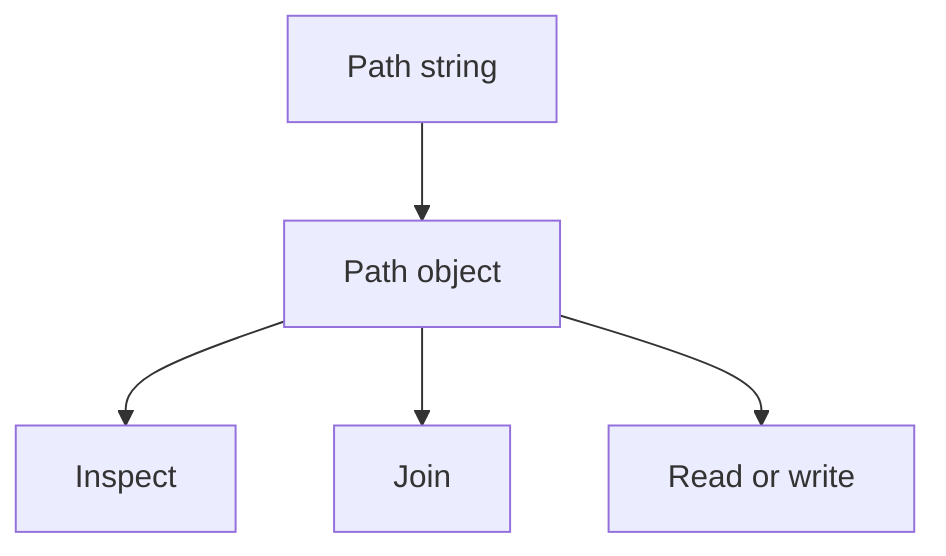

# `pathlib`: Beginner-to-Expert Notes

## 1. Learning goals

By the end of this note, you should be able to:

- create and combine paths with `Path`;
- inspect path properties;
- read and write text files with `pathlib`;
- understand why `pathlib` is preferred for new path code.

## 2. Prerequisites

- Files and directories
- Basic object usage

## 3. Topic at a glance

`pathlib` gives you a clean object-oriented way to work with filesystem paths.
It is usually easier to read than manual string-based path handling.

### Minimal first example

```python
from pathlib import Path

path = Path("data") / "report.csv"
print(path)
```

Output:

```text
data/report.csv
```

Why this output?

The `/` operator joins path parts in a readable way.

Roadmap: first we build the mental model, then we learn the core methods, then we compare with `os`, and finally we practice safe file handling.

## 4. Core vocabulary

| Term | Plain-language meaning | Example |
| --- | --- | --- |
| `Path` | object representing a file or directory path | `Path("data")` |
| Parent | enclosing directory | `path.parent` |
| Name | final path component | `path.name` |
| Suffix | file extension | `path.suffix` |
| Exists | whether the path is present | `path.exists()` |

## 5. Mental model



## 6. Foundations

### 6.1 Join path parts

```python
from pathlib import Path

path = Path("data") / "report.csv"
print(path)
```

Output:

```text
data/report.csv
```

### 6.2 Inspect path parts

```python
from pathlib import Path

path = Path("data/report.csv")
print(path.name)
print(path.suffix)
```

Output:

```text
report.csv
.csv
```

### 6.3 Read and write text

```python
from pathlib import Path
import tempfile

with tempfile.TemporaryDirectory() as tmp:
    file_path = Path(tmp) / "note.txt"
    file_path.write_text("hello", encoding="utf-8")
    print(file_path.read_text(encoding="utf-8"))
```

Output:

```text
hello
```

## 7. How it works

`Path` objects keep path behavior together.
That makes code easier to read, test, and refactor than manual string operations.

## 8. Core operations or methods

- `Path(...)`
- `/` path joining
- `name`, `suffix`, `parent`
- `exists()`
- `read_text()`
- `write_text()`

## 9. Guided examples

### Example 1: Join paths

```python
from pathlib import Path

print(Path("logs") / "app.log")
```

Output:

```text
logs/app.log
```

### Example 2: Inspect a file path

```python
from pathlib import Path

path = Path("logs/app.log")
print(path.name)
print(path.suffix)
```

Output:

```text
app.log
.log
```

### Example 3: Round-trip text content

```python
from pathlib import Path
import tempfile

with tempfile.TemporaryDirectory() as tmp:
    file_path = Path(tmp) / "data.txt"
    file_path.write_text("Python", encoding="utf-8")
    print(file_path.read_text(encoding="utf-8"))
```

Output:

```text
Python
```

## 10. Common patterns and real-world applications

- build file paths safely;
- read and write config or report files;
- inspect extensions before processing;
- avoid manual string concatenation for paths.

## 11. Common mistakes, misconceptions, and failure cases

### Mistake 1: Using raw string concatenation for paths

### Mistake 2: Forgetting encoding when reading text files

### Mistake 3: Treating paths like plain strings when methods exist

## 12. Comparison and decision guide

| Need | Best choice | Why |
| --- | --- | --- |
| New path code | `pathlib` | readable and modern |
| Low-level compatibility | `os.path` | system-style helpers |

## 13. Efficiency, limitations, safety, and best practices

- use `pathlib` by default for path manipulation;
- be explicit about encoding for text files;
- validate paths before using them in scripts.

## 14. Advanced concepts

- globbing;
- recursive search;
- path resolution.

## 15. Interview or assessment knowledge

- Why is `pathlib` preferred in new code?
- What does `path.parent` mean?
- Why is `/` used for joining paths?

## 16. Practice exercises

1. Join two path parts with `Path`.
2. Print the file name and suffix.
3. Write and read a short text file.
4. Explain why `pathlib` is easier to read than string concatenation.
5. Explain what `exists()` checks.

### Solutions

#### Solution 1

```python
from pathlib import Path

print(Path("data") / "report.csv")
```

Output:

```text
data/report.csv
```

#### Solution 2

```python
from pathlib import Path

path = Path("data/report.csv")
print(path.name)
print(path.suffix)
```

Output:

```text
report.csv
.csv
```

#### Solution 3

```python
from pathlib import Path
import tempfile

with tempfile.TemporaryDirectory() as tmp:
    file_path = Path(tmp) / "x.txt"
    file_path.write_text("hello", encoding="utf-8")
    print(file_path.read_text(encoding="utf-8"))
```

Output:

```text
hello
```

#### Solution 4

`pathlib` is easier to read because path behavior is represented by objects instead of manual strings.

#### Solution 5

`exists()` checks whether the path is present on the filesystem.

## 17. Summary cheat sheet

| Method | Use |
| --- | --- |
| `Path()` | create a path object |
| `/` | join path parts |
| `name` | final component |
| `suffix` | file extension |
| `read_text()` | read file text |
| `write_text()` | write file text |

## 18. Mastery checklist and next steps

- [ ] I can use `Path` to build paths.
- [ ] I can inspect file name and suffix.
- [ ] I can read and write text files.
- [ ] I prefer `pathlib` for new code.

Next topics:

- `16_datetime.md`
- `17_basic_scripting_and_automation.md`
