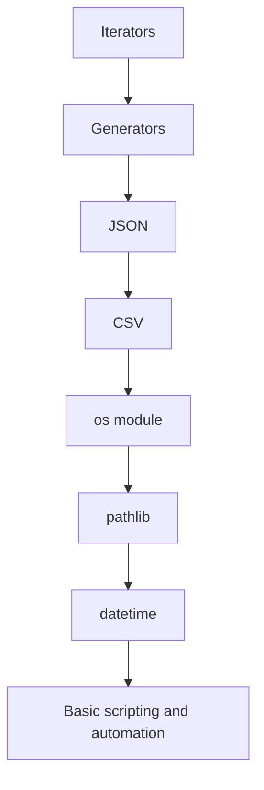
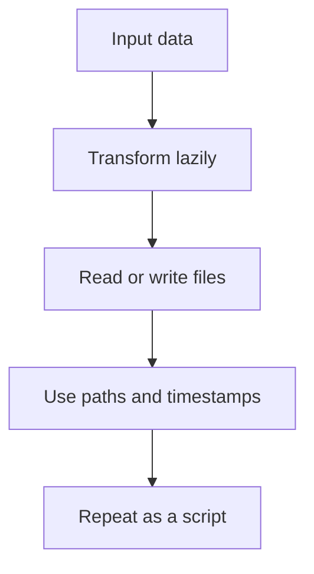

# Python Automation and Data Processing Mastery Roadmap: Beginner-to-Expert Notes

## 1. Learning goals

By the end of this track, you should be able to:

- use iterators and generators to process data lazily;
- read and write JSON and CSV safely;
- work with `os`, `pathlib`, and `datetime` for real scripts;
- build small automation scripts that are easy to test and maintain.

## 2. Prerequisites

- Basic Python syntax
- Functions, loops, and lists
- A little comfort with files and modules

## 3. Topic at a glance

This folder teaches the practical standard-library tools used for lightweight automation and data handling.
It is like a toolbox for moving, shaping, and organizing data without needing a heavy framework.

### Roadmap at a glance



## 4. Core vocabulary

| Term | Plain-language meaning | Example |
| --- | --- | --- |
| Iterable | Something you can loop over | `range(3)` |
| Iterator | One-pass object that yields values | `iter([1, 2, 3])` |
| Generator | A function or expression that yields values lazily | `yield` |
| JSON | Text format for structured data | `{"name": "Ana"}` |
| CSV | Table format with rows and columns | `name,age` |
| Path | File or directory location | `Path("data/file.txt")` |
| Timestamp | A specific point in time | `datetime(...)` |
| Automation | A repeatable script that performs a task | cleanup script |

## 5. Mental model

Use the right tool for the job:

- iterators and generators for lazy processing;
- JSON and CSV for data exchange;
- `os` and `pathlib` for filesystem work;
- `datetime` for time-aware tasks;
- scripts for repeatable operations.

## 6. Foundations

### 6.1 Learn to think lazily

Many data tasks do not need to load everything into memory at once.

### 6.2 Learn file and data formats

JSON and CSV are common ways to move data between systems.

### 6.3 Learn filesystem and time basics

Automation usually needs paths, files, and timestamps.

## 7. How it works



## 8. Core topics in this module

### 8.1 Iterators

Learn one-pass traversal and `next()`.

### 8.2 Generators

Learn `yield`, generator pipelines, and lazy results.

### 8.3 JSON

Learn `json.load`, `json.dump`, `loads`, and `dumps`.

### 8.4 CSV

Learn row-based and dictionary-based CSV handling.

### 8.5 `os`

Learn environment and filesystem basics.

### 8.6 `pathlib`

Learn readable path handling.

### 8.7 `datetime`

Learn date, time, and timedelta basics.

### 8.8 Basic scripting and automation

Learn how to assemble a small repeatable script.

## 9. Guided examples

### Example 1: Lazy processing

```text
process one item at a time instead of building a huge temporary list
```

### Example 2: Structured data

```text
use JSON for nested data and CSV for rows and columns
```

### Example 3: Automation

```text
read inputs, transform them, write outputs, and repeat safely
```

## 10. Common patterns and real-world applications

- stream values with generators;
- save data exchange payloads as JSON;
- import spreadsheets or tabular exports as CSV;
- build cleanup, rename, and reporting scripts;
- manage paths and times explicitly.

## 11. Common mistakes, misconceptions, and failure cases

- consuming an iterator twice;
- treating JSON like a Python object without validation;
- using CSV without handling headers and newlines;
- joining paths with string concatenation;
- using naive timestamps without knowing the timezone.

## 12. Comparison and decision guide

| Need | Best choice | Why |
| --- | --- | --- |
| One-pass values | iterator/generator | lazy and memory-friendly |
| Nested structured data | JSON | widely supported |
| Flat tabular data | CSV | simple row format |
| Filesystem work | `pathlib` | readable path handling |
| System or legacy path APIs | `os` | low-level compatibility |

## 13. Efficiency, limitations, safety, and best practices

- keep pipelines lazy when possible;
- validate external data before trusting it;
- use explicit paths and encodings;
- make scripts deterministic and easy to rerun;
- avoid hidden state and surprising side effects.

## 14. Advanced concepts

- generator composition;
- JSON schema-like validation at the boundary;
- CSV quoting and delimiter handling;
- atomic file updates;
- timezone-aware datetimes.

## 15. Interview or assessment knowledge

- Why is a generator lazy?
- When would you choose CSV over JSON?
- Why is `pathlib` easier to read than string path joining?
- What makes a script automation-friendly?

## 16. Practice exercises

1. Explain the difference between iterable and iterator.
2. Describe one safe use of JSON.
3. Describe one CSV pitfall.
4. Explain why scripts should use explicit paths.
5. Explain why timezone-aware datetimes matter.

## 17. Summary cheat sheet

| Topic | Remember |
| --- | --- |
| Iterators | one pass |
| Generators | lazy values |
| JSON | structured text |
| CSV | table rows |
| `os` | low-level system tools |
| `pathlib` | clean path handling |
| `datetime` | time-aware logic |
| Scripts | repeatable automation |

## 18. Mastery checklist and next steps

- [ ] I can explain lazy processing.
- [ ] I can read and write JSON and CSV.
- [ ] I can work with paths safely.
- [ ] I can use datetimes intentionally.
- [ ] I can build a small repeatable script.

Next topics:

- `10_iterators.md`
- `11_generators.md`
- `12_json.md`
- `13_csv.md`
- `14_os_module.md`
- `15_pathlib.md`
- `16_datetime.md`
- `17_basic_scripting_and_automation.md`
