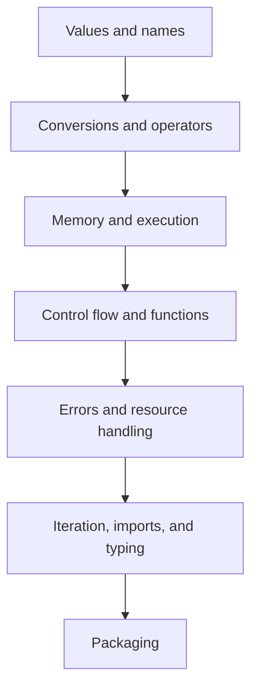

# PYTHON FUNDAMENTALS - ROADMAP

Study the notes in order. Each layer depends on the mental model built before it.

## 1. Learning Path



## 2. Phase One: Values and Runtime Foundations

| Order | Note | Main question |
| --- | --- | --- |
| 1 | [Datatypes](Datatypes.md) | What kinds of values exist? |
| 2 | [Variables and name binding](<variables model.md>) | How do names reference objects? |
| 3 | [Constants, conversions, and built-ins](constants_type_conversion_and_builtins.md) | How are values inspected and converted? |
| 4 | [Operators](operators.md) | How are values combined and compared? |
| 5 | [Memory model](MemoryModel.md) | How do identity, sharing, copying, and lifetime work? |
| 6 | [Execution model](<execution model.md>) | In what order does Python run code? |

### Phase-One Checkpoint

You are ready to continue when you can:

- distinguish a name, object, type, value, and identity;
- predict mutation versus rebinding;
- choose an appropriate built-in data type;
- explain shallow versus deep copying;
- evaluate operator precedence and type conversion;
- trace module and function execution order.

## 3. Phase Two: Program Behavior

| Order | Note | Main question |
| --- | --- | --- |
| 7 | [Control flow](control_flow.md) | Which statement runs next? |
| 8 | [Functions](function.md) | How is behavior packaged and called? |
| 9 | [Errors, exceptions, and debugging](exceptions_and_error_handling_mastery.md) | How does failure change execution? |

### Phase-Two Checkpoint

You are ready to continue when you can:

- trace branches, loops, short-circuiting, and loop `else`;
- bind positional, keyword, default, and variadic arguments;
- apply LEGB scope rules;
- explain closures and recursion;
- raise, catch, translate, and re-raise specific exceptions;
- read a traceback and diagnose common errors.

## 4. Phase Three: Python Protocols and Boundaries

| Order | Note | Main question |
| --- | --- | --- |
| 10 | [Iterators, generators, and context managers](iterators_generators_context_managers.md) | How are values produced lazily and resources cleaned up? |
| 11 | [Modules, packages, and imports](modules_packages_import_system_mastery.md) | How is code organized and loaded? |
| 12 | [Type hints and static analysis](type_hints_static_analysis_mastery.md) | How are contracts checked before runtime? |
| 13 | [File handling](file_io_pathlib_serialization_mastery.md) | How does data cross the filesystem boundary? |

### Phase-Three Checkpoint

You are ready to continue when you can:

- distinguish iterable, iterator, and generator;
- implement deterministic cleanup with `with`;
- explain import execution, caching, and circular imports;
- annotate functions, collections, protocols, and generic code;
- separate static typing from runtime validation;
- read and write text, binary, JSON, and CSV data safely.

## 5. Phase Four: Distribution

| Order | Note | Main question |
| --- | --- | --- |
| 14 | [Modern packaging](modern_packaging_pyproject_wheels.md) | How does source become an installable release? |

### Phase-Four Checkpoint

You have completed the fundamentals track when you can:

- explain import package versus distribution;
- configure a `src`-layout project with `pyproject.toml`;
- build a wheel and source distribution;
- test the wheel in a clean environment;
- expose a deliberate package API and console command;
- describe a safe release flow.

## 6. Topic Boundaries

Some concepts appear in several notes from different angles.

| Concept | Primary note | Related note |
| --- | --- | --- |
| mutability | Datatypes | Variables, Memory model |
| identity and aliases | Memory model | Variables |
| LEGB scope | Functions | Execution model |
| short-circuiting | Control flow | Operators |
| exception propagation | Errors | Execution model |
| `with` cleanup | Iterators/context managers | File handling |
| package imports | Modules/imports | Packaging |
| runtime validation | Errors | Type hints |

Study the primary note first. Use the related note to understand the same behavior in context.

## 7. Practice Method

For every code example:

1. hide the output;
2. predict the result;
3. trace names and objects;
4. run the snippet;
5. explain any difference;
6. change one value and predict again.

## 8. Problem-Solving Checklist

When reading unfamiliar Python code, ask:

1. Which objects are created?
2. Which names reference them?
3. Which operations mutate and which rebind?
4. What is the exact evaluation order?
5. Which branch, loop, call, yield, or exception changes control flow?
6. Which cleanup must run?
7. What data crosses an external boundary?
8. Which assumptions are checked statically and which are validated at runtime?

## 9. Final Goal

Fundamentals mastery means you can explain why Python behaves as it does, not only remember syntax.

You should be able to move from:

```text
read code -> predict state -> predict output -> run -> verify -> explain
```

That reasoning process is the foundation for object-oriented programming, testing, concurrency, frameworks, and production systems.
