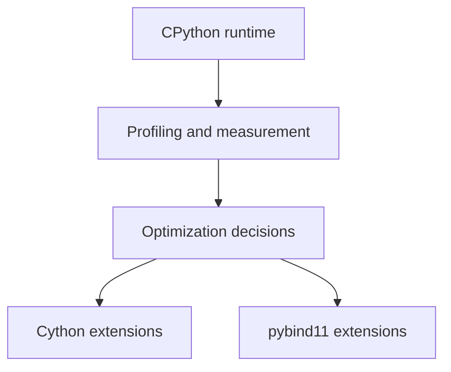
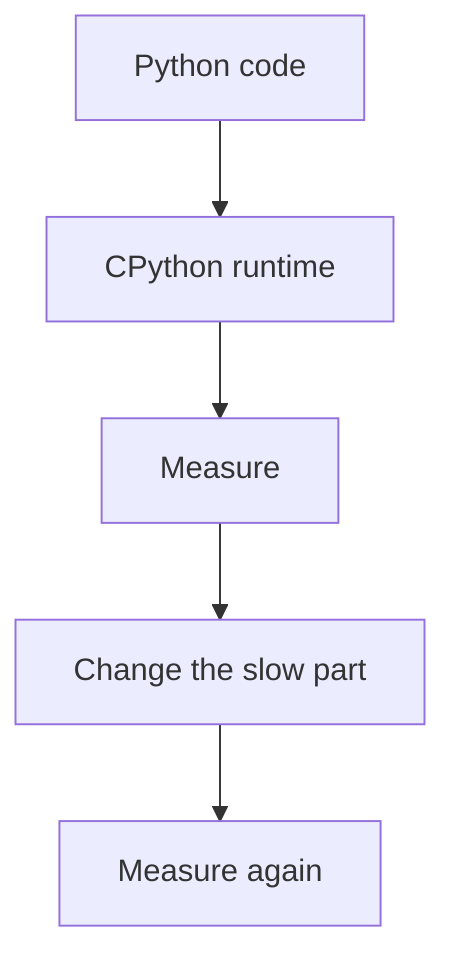

# CPython Internals and Performance Roadmap: Beginner-to-Expert Notes

## 1. Learning goals

By the end of this track, you should be able to:

- explain how CPython executes Python code at a high level;
- reason about performance using profiling instead of guessing;
- know when native extensions are worth the complexity;
- understand the tradeoffs among Python, Cython, and pybind11.

## 2. Prerequisites

- Solid Python fundamentals
- Basic comfort with functions, modules, and types

## 3. Topic at a glance

This folder teaches how Python runs under the hood and how to reason about speed and extension choices.
It is the map for understanding runtime behavior and performance tradeoffs.

### Roadmap at a glance



## 4. Core vocabulary

| Term | Plain-language meaning | Example |
| --- | --- | --- |
| CPython | the standard Python implementation | default Python runtime |
| Runtime | how code behaves while running | execution model |
| Profiling | measuring where time goes | `cProfile` |
| Optimization | making code faster or lighter | better algorithm |
| Extension | native code module for Python | Cython, pybind11 |

## 5. Mental model



## 6. Foundations

### 6.1 Understand runtime behavior

### 6.2 Measure before optimizing

### 6.3 Choose the simplest tool that solves the bottleneck

## 7. How it works

CPython executes bytecode and manages objects, memory, and calls.
Performance work starts with identifying where time or memory is actually spent.

## 8. Core topics in this module

### 8.1 CPython runtime internals

### 8.2 Profiling and performance optimization

### 8.3 Cython native extensions

### 8.4 pybind11 C++ extensions

## 9. Guided examples

### Example 1: Measure first

```text
find the bottleneck before changing code
```

### Example 2: Optimize only the hot path

```text
change the slowest part, not the whole codebase
```

### Example 3: Use native code only when needed

```text
use extension modules for real hotspots and integration needs
```

## 10. Common patterns and real-world applications

- profile application hotspots;
- improve algorithms before using native extensions;
- use Cython or pybind11 only for real bottlenecks;
- keep performance changes measurable.

## 11. Common mistakes, misconceptions, and failure cases

- guessing where the slowdown is;
- optimizing low-impact code;
- introducing native complexity too early;
- measuring only once and trusting the first result.

## 12. Comparison and decision guide

| Need | Best choice | Why |
| --- | --- | --- |
| Understand runtime behavior | CPython internals | foundation for reasoning |
| Find bottlenecks | profiling | shows where time goes |
| Speed up hot loops | algorithm changes first | simplest win |
| Native extension | Cython or pybind11 | only for proven hotspots |

## 13. Efficiency, limitations, safety, and best practices

- measure before and after;
- prefer algorithmic fixes first;
- keep native boundaries small;
- preserve test coverage around optimization work.

## 14. Advanced concepts

- memory layout and object overhead;
- interpreter dispatch;
- extension module boundaries;
- native interoperability tradeoffs.

## 15. Interview or assessment knowledge

- Why profile before optimizing?
- When is a native extension justified?
- What is the difference between CPython and Python as a language?

## 16. Practice exercises

1. Explain why profiling comes before optimization.
2. Explain when to use a native extension.
3. Explain why algorithmic improvements come first.
4. Explain one risk of premature optimization.
5. Explain what a bottleneck is.

## 17. Summary cheat sheet

| Topic | Remember |
| --- | --- |
| Runtime | how code executes |
| Profiling | measure first |
| Optimization | change the hot spot |
| Extensions | use only when needed |

## 18. Mastery checklist and next steps

- [ ] I can explain the track goals.
- [ ] I know that measurement comes first.
- [ ] I understand when native extensions make sense.

Next topics:

- `01-cpython-runtime-internals.md`
- `02-profiling-and-performance-optimization.md`
- `03-cython-native-extensions.md`
- `04-pybind11-cpp-extensions.md`
