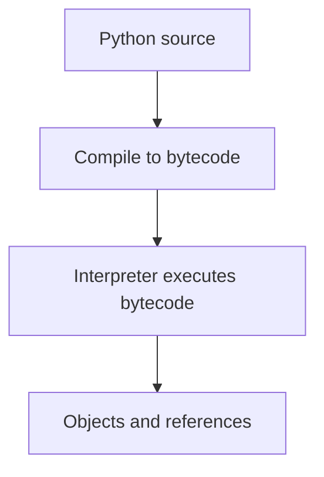

# CPython Runtime Internals: Beginner-to-Expert Notes

## 1. Learning goals

By the end of this note, you should be able to:

- explain what CPython is at a high level;
- understand that Python code becomes bytecode executed by the interpreter;
- reason about objects, references, and runtime overhead;
- know why internals matter for performance decisions.

## 2. Prerequisites

- Python fundamentals
- Basic familiarity with functions, modules, and objects

## 3. Topic at a glance

CPython is the standard Python interpreter most people use.
It runs your code, manages objects, and executes bytecode step by step.

### Minimal first example

```python
def add(left: int, right: int) -> int:
    return left + right


print(add(2, 3))
```

Output:

```text
5
```

Why this output?

The function returns the sum of the two integers, and CPython executes that function through its interpreter runtime.

Roadmap: first we build the mental model, then we learn the runtime pieces, then we compare behavior costs, and finally we practice reasoning about internals.

## 4. Core vocabulary

| Term | Plain-language meaning | Example |
| --- | --- | --- |
| CPython | standard Python implementation | interpreter |
| Bytecode | low-level instructions Python executes | compiled function code |
| Object | runtime value with identity and type | list, int, str |
| Reference | a pointer-like connection to an object | assignment |
| Interpreter | program that runs Python code | CPython executable |

## 5. Mental model



## 6. Foundations

### 6.1 Python source is compiled before execution

### 6.2 Objects live at runtime and are referenced, not copied by default

### 6.3 Interpreter overhead matters in tight loops

## 7. How it works

CPython turns source into bytecode, then executes that bytecode through the interpreter loop.
That runtime model explains why small design choices can matter in hot code paths.

## 8. Core operations or methods

- object creation and reference handling;
- bytecode execution;
- function call overhead;
- import and module loading behavior.

## 9. Guided examples

### Example 1: A simple function

```python
def add(left: int, right: int) -> int:
    return left + right


print(add(2, 3))
```

Output:

```text
5
```

### Example 2: Reference behavior

```python
values = [1, 2]
other = values
other.append(3)
print(values)
```

Output:

```text
[1, 2, 3]
```

### Example 3: Function calls are runtime work

```python
def identity(value: int) -> int:
    return value


print(identity(7))
```

Output:

```text
7
```

## 10. Common patterns and real-world applications

- reason about aliasing and mutability;
- understand why repeated function calls cost something;
- identify where interpreter overhead is acceptable and where it is not.

## 11. Common mistakes, misconceptions, and failure cases

### Mistake 1: Treating Python like a compiled language with zero runtime overhead

### Mistake 2: Ignoring reference behavior for mutable objects

### Mistake 3: Assuming imports are free

## 12. Comparison and decision guide

| Need | Best choice | Why |
| --- | --- | --- |
| Understand execution model | CPython internals | explains runtime behavior |
| Optimize a hot path | measure first | avoids guesswork |
| Reduce object overhead | simpler data structures | less runtime cost |

## 13. Efficiency, limitations, safety, and best practices

- keep hot loops simple;
- avoid unnecessary object creation;
- measure before changing internals-related code;
- do not rely on internals that are not part of the public contract.

## 14. Advanced concepts

- bytecode inspection;
- interpreter dispatch;
- object and reference management;
- runtime costs of abstraction.

## 15. Interview or assessment knowledge

- What is CPython?
- What is bytecode?
- Why do references matter?
- Why can imports affect startup time?

## 16. Practice exercises

1. Explain what CPython is.
2. Explain what bytecode is.
3. Show reference behavior with a list.
4. Explain why object creation has cost.
5. Explain why imports can affect startup time.

## 17. Summary cheat sheet

| Concept | Remember |
| --- | --- |
| CPython | standard interpreter |
| Bytecode | runtime instructions |
| Reference | points to an object |
| Imports | execute top-level code |

## 18. Mastery checklist and next steps

- [ ] I can explain CPython at a high level.
- [ ] I understand object references.
- [ ] I know why runtime overhead matters.

Next topics:

- `02-profiling-and-performance-optimization.md`
- `03-cython-native-extensions.md`
- `04-pybind11-cpp-extensions.md`
