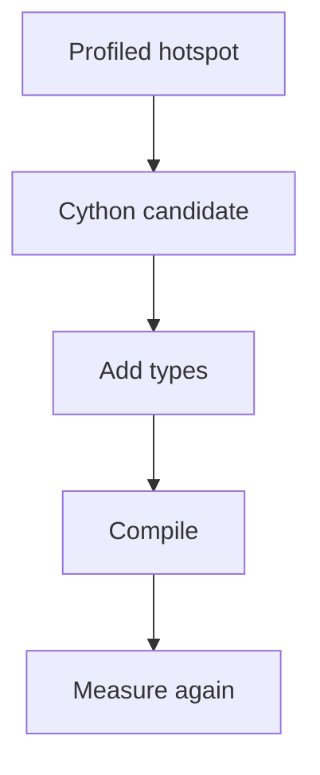

# Cython Native Extensions: Beginner-to-Expert Notes

## 1. Learning goals

By the end of this note, you should be able to:

- explain what Cython is at a high level;
- understand why it can speed up hot code;
- know when Cython is worth the added build complexity;
- compare it with pure Python and other extension approaches.

## 2. Prerequisites

- Performance profiling basics
- CPython runtime awareness

## 3. Topic at a glance

Cython lets you write code that can be compiled into a native extension.
It is useful when profiling shows a real bottleneck that Python alone cannot solve efficiently.

### Minimal first example

```python
print("cython")
```

Output:

```text
cython
```

Why this output?

The example just marks the topic; the real point is that Cython can turn a Python-like source file into compiled extension code.

Roadmap: first we build the mental model, then we learn why Cython helps, then we compare tradeoffs, and finally we practice choosing it wisely.

## 4. Core vocabulary

| Term | Plain-language meaning | Example |
| --- | --- | --- |
| Cython | Python-like language that can compile to native code | `.pyx` |
| Native extension | compiled module loaded by Python | shared library |
| Type declaration | extra type info for speed | `cdef int x` |
| Hot loop | repeated inner loop worth optimizing | numeric processing |

## 5. Mental model



## 6. Foundations

### 6.1 Cython is for proven hotspots

### 6.2 Type declarations can reduce overhead

### 6.3 Build and test complexity increases

## 7. How it works

Cython translates code into C, which is then compiled into a Python extension module.
That can reduce interpreter overhead for tight loops and heavy numeric work.

## 8. Core operations or methods

- identify a hotspot;
- add type declarations carefully;
- compile the extension;
- benchmark the result.

## 9. Guided examples

### Example 1: Use after profiling

```text
measure first, then decide if Cython is needed
```

### Example 2: Focus on hot loops

```text
optimize repeated numeric work, not everything
```

### Example 3: Re-check performance

```text
profile -> convert hotspot -> profile again
```

## 10. Common patterns and real-world applications

- numeric loops;
- data processing hotspots;
- performance-sensitive libraries;
- bridging Python convenience with compiled speed.

## 11. Common mistakes, misconceptions, and failure cases

### Mistake 1: Using Cython before measuring

### Mistake 2: Expecting every Python feature to speed up automatically

### Mistake 3: Adding native complexity to non-hot code

## 12. Comparison and decision guide

| Need | Best choice | Why |
| --- | --- | --- |
| Pure Python simplicity | Python | easiest to maintain |
| Measured hot loop speedup | Cython | can reduce interpreter overhead |
| C++ interoperability | pybind11 | better for C++-centric code |

## 13. Efficiency, limitations, safety, and best practices

- only optimize measured hotspots;
- keep extension boundaries small;
- maintain tests around the compiled path;
- document build requirements.

## 14. Advanced concepts

- typed memory access;
- C-level loops;
- calling into C libraries.

## 15. Interview or assessment knowledge

- What is Cython?
- When is it useful?
- Why does it add complexity?
- Why profile first?

## 16. Practice exercises

1. Explain when Cython might help.
2. Explain why profiling comes first.
3. Explain one cost of using Cython.
4. Explain what a native extension is.
5. Explain why hot loops matter.

### Solutions

#### Solution 1

Cython may help when a real hotspot is limited by Python interpreter overhead.

#### Solution 2

Profiling comes first so you optimize the actual bottleneck.

#### Solution 3

It adds build complexity and more moving parts.

#### Solution 4

A native extension is compiled code loaded by Python as a module.

#### Solution 5

Hot loops matter because they dominate runtime in performance-sensitive code.

## 17. Summary cheat sheet

| Concept | Remember |
| --- | --- |
| Cython | compiled Python-like code |
| Native extension | compiled module |
| Use case | proven hotspot |
| Cost | extra build complexity |

## 18. Mastery checklist and next steps

- [ ] I can explain Cython at a high level.
- [ ] I know when it is worth using.
- [ ] I understand that profiling must come first.

Next topics:

- `04-pybind11-cpp-extensions.md`
