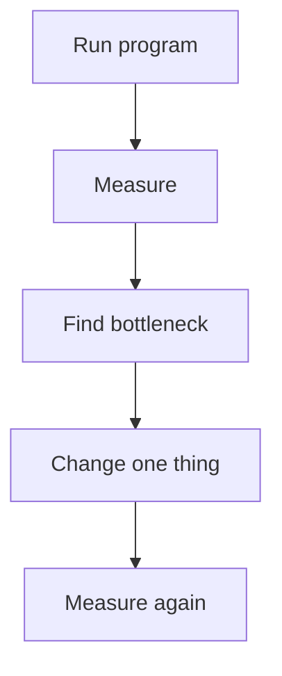

# Profiling and Performance Optimization: Beginner-to-Expert Notes

## 1. Learning goals

By the end of this note, you should be able to:

- explain why profiling comes before optimization;
- identify slow spots instead of guessing;
- know the difference between algorithmic and micro optimizations;
- measure before and after a change.

## 2. Prerequisites

- Basic Python execution knowledge
- Familiarity with functions and loops

## 3. Topic at a glance

Profiling tells you where time is actually going.
Optimization means improving the right thing after you know the bottleneck.

### Minimal first example

```python
def total(values: list[int]) -> int:
    return sum(values)


print(total([1, 2, 3]))
```

Output:

```text
6
```

Why this output?

The function adds the list items, and profiling would tell you whether this or something else is expensive in a real program.

Roadmap: first we build the mental model, then we learn measurement habits, then we compare optimization types, and finally we practice choosing the right fix.

## 4. Core vocabulary

| Term | Plain-language meaning | Example |
| --- | --- | --- |
| Profiling | measuring time and resource use | `cProfile` |
| Hot path | code that runs a lot or costs a lot | inner loop |
| Bottleneck | limiting slow part | expensive function |
| Algorithmic optimization | change the approach | better complexity |
| Micro optimization | small local tweak | local variable reuse |

## 5. Mental model



## 6. Foundations

### 6.1 Measure first

### 6.2 Optimize the bottleneck, not the guess

### 6.3 Keep changes small and verifiable

## 7. How it works

Profiling reveals where time and sometimes memory are spent.
Optimization should follow the measured evidence, not intuition alone.

## 8. Core operations or methods

- profile the program;
- inspect hot functions;
- compare before and after;
- keep a baseline.

## 9. Guided examples

### Example 1: Simple result

```python
print(sum([1, 2, 3]))
```

Output:

```text
6
```

### Example 2: Avoid guessing

```text
measure before changing code
```

### Example 3: Compare a change

```text
before -> measure -> change -> measure again
```

## 10. Common patterns and real-world applications

- profiling slow requests;
- measuring batch jobs;
- checking memory-heavy code;
- tuning only proven hot spots.

## 11. Common mistakes, misconceptions, and failure cases

### Mistake 1: Optimizing without profiling

### Mistake 2: Making the wrong part faster

### Mistake 3: Changing many things at once

## 12. Comparison and decision guide

| Need | Best choice | Why |
| --- | --- | --- |
| Find bottleneck | profiling | shows real cost |
| Improve logic | algorithm change | best ROI |
| Fine-tune a hotspot | targeted optimization | limited scope |

## 13. Efficiency, limitations, safety, and best practices

- measure on representative data;
- keep one baseline;
- change one variable at a time;
- prefer algorithmic wins first.

## 14. Advanced concepts

- CPU versus memory profiling;
- sampling versus tracing;
- benchmark noise and variance.

## 15. Interview or assessment knowledge

- Why profile before optimizing?
- What is a bottleneck?
- Why is algorithmic improvement usually better than micro optimization?

## 16. Practice exercises

1. Explain why profiling comes first.
2. Explain what a hot path is.
3. Explain why one change at a time matters.
4. Explain an algorithmic optimization.
5. Explain one risk of micro optimization.

### Solutions

#### Solution 1

Profiling first prevents wasted effort on the wrong code.

#### Solution 2

A hot path is code that runs often or costs a lot.

#### Solution 3

One change at a time makes it easier to know what helped.

#### Solution 4

An algorithmic optimization changes the approach to do less work overall.

#### Solution 5

Micro optimization can make code harder to read without meaningful gain.

## 17. Summary cheat sheet

| Concept | Remember |
| --- | --- |
| Profiling | measure first |
| Bottleneck | slowest meaningful part |
| Algorithmic fix | best first choice |
| Micro optimization | last-mile tuning |

## 18. Mastery checklist and next steps

- [ ] I know why profiling comes first.
- [ ] I can define a bottleneck.
- [ ] I can distinguish algorithmic and micro optimizations.

Next topics:

- `03-cython-native-extensions.md`
- `04-pybind11-cpp-extensions.md`
