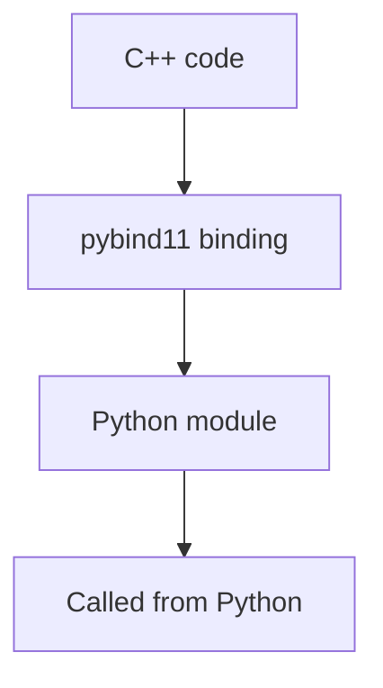

# pybind11 C++ Extensions: Beginner-to-Expert Notes

## 1. Learning goals

By the end of this note, you should be able to:

- explain what pybind11 is at a high level;
- understand why it is useful for C++ integration;
- know when pybind11 is a better fit than Cython;
- recognize the build and maintenance tradeoffs.

## 2. Prerequisites

- Profiling basics
- High-level idea of native extensions

## 3. Topic at a glance

pybind11 helps expose C++ code to Python in a clean way.
It is useful when the performance-sensitive or reusable part already exists in C++.

### Minimal first example

```python
print("pybind11")
```

Output:

```text
pybind11
```

Why this output?

The example marks the topic; the key idea is that pybind11 makes C++ functions look like normal Python modules.

Roadmap: first we build the mental model, then we learn when to use it, then we compare tradeoffs, and finally we practice choosing it safely.

## 4. Core vocabulary

| Term | Plain-language meaning | Example |
| --- | --- | --- |
| pybind11 | C++ binding library for Python | extension module |
| Binding | bridge between C++ and Python | exposed function |
| Native code | compiled machine code | C++ library |
| Interop | working across languages | Python calling C++ |

## 5. Mental model



## 6. Foundations

### 6.1 pybind11 is for existing C++ code

### 6.2 It is often the cleanest C++ interop path

### 6.3 Build complexity is part of the cost

## 7. How it works

pybind11 wraps C++ functions, classes, and data so Python can call them naturally.
That gives you native speed or native reuse with a Python-friendly API.

## 8. Core operations or methods

- expose a C++ function;
- expose a C++ class;
- build the extension;
- test the Python-facing API.

## 9. Guided examples

### Example 1: Use for C++ interop

```text
use pybind11 when the implementation already lives in C++
```

### Example 2: Keep the Python API simple

```text
make the binding feel like a normal Python module
```

### Example 3: Verify after build

```text
build -> import -> test -> release
```

## 10. Common patterns and real-world applications

- exposing existing C++ libraries;
- accelerating performance-sensitive code;
- keeping a Python API thin while native code does the work.

## 11. Common mistakes, misconceptions, and failure cases

### Mistake 1: Using pybind11 without a real C++ need

### Mistake 2: Hiding complicated Python logic in the binding layer

### Mistake 3: Forgetting to test the compiled artifact

## 12. Comparison and decision guide

| Need | Best choice | Why |
| --- | --- | --- |
| Existing C++ library | pybind11 | natural fit |
| Python-like optimized source | Cython | simpler for Python-centric code |
| Pure Python maintainability | Python | lowest complexity |

## 13. Efficiency, limitations, safety, and best practices

- use pybind11 when C++ already exists or is clearly justified;
- keep the Python API thin and readable;
- test the built extension, not just source files.

## 14. Advanced concepts

- exposing classes and containers;
- ownership and lifetime boundaries;
- exception translation across languages.

## 15. Interview or assessment knowledge

- What is pybind11?
- When is it a good fit?
- How is it different from Cython?
- Why does it increase build complexity?

## 16. Practice exercises

1. Explain what pybind11 is for.
2. Explain one reason to use it.
3. Explain one cost of using it.
4. Explain how it differs from Cython.
5. Explain why testing the built artifact matters.

### Solutions

#### Solution 1

pybind11 exposes C++ code to Python.

#### Solution 2

It is useful when you already have C++ code you want to call from Python.

#### Solution 3

It adds native build and maintenance complexity.

#### Solution 4

Cython is more Python-like, while pybind11 is more C++-centric.

#### Solution 5

Testing the built artifact ensures the compiled module works in real install conditions.

## 17. Summary cheat sheet

| Concept | Remember |
| --- | --- |
| pybind11 | C++ binding library |
| Best use | existing C++ code |
| Tradeoff | build complexity |
| Goal | Python-friendly interop |

## 18. Mastery checklist and next steps

- [ ] I can explain pybind11 at a high level.
- [ ] I know when it is a good fit.
- [ ] I understand it is different from Cython.

Next topics:

- `03-cython-native-extensions.md`
