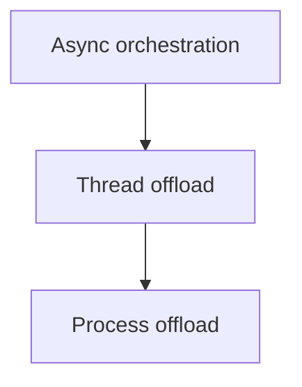

# Async, Thread, and Process Integration: Beginner-to-Expert Notes

## 1. Learning goals

By the end of this note, you should be able to:

- explain that different concurrency models solve different problems;
- know when it makes sense to combine them;
- understand the need for clear boundaries between async, threads, and processes;
- avoid mixing models without a reason.

## 2. Prerequisites

- Sync, async, threads, and processes
- Reliability and design pattern basics

## 3. Topic at a glance

Real systems sometimes need more than one concurrency model.
The important part is to keep the boundaries clear.

### Minimal first example

```text
async -> thread -> process
```

Output:

```text
async -> thread -> process
```

Why this output?

The example shows the direction of integration from high-level orchestration to lower-level execution.

Roadmap: first we build the mental model, then we learn integration boundaries, then we compare options, and finally we practice picking the simplest workable shape.

## 4. Core vocabulary

| Term | Plain-language meaning | Example |
| --- | --- | --- |
| Boundary | place where one model hands work to another | async to thread |
| Bridge | code that connects models | adapter function |
| Orchestration | high-level coordination | async service |
| Offload | move work to another execution model | CPU task to process |

## 5. Mental model



## 6. Foundations

### 6.1 Keep each model focused

### 6.2 Use bridges deliberately

### 6.3 Avoid hidden mixing of models

## 7. How it works

Async code is often good for orchestration.
Threads can help with blocking calls.
Processes can help with CPU-heavy work.
The integration should be deliberate, not accidental.

## 8. Core operations or methods

- async orchestration;
- thread offloading;
- process offloading;
- clear adapters at model boundaries.

## 9. Guided examples

### Example 1: Clear boundary

```text
async orchestrates, thread waits, process computes
```

### Example 2: Do not mix blindly

```text
choose the smallest model that fits the work
```

### Example 3: Keep adapters narrow

```text
one boundary, one purpose
```

## 10. Common patterns and real-world applications

- async API service with threaded blocking adapters;
- async coordination plus process-based CPU work;
- staged systems with clear responsibility handoff.

## 11. Common mistakes, misconceptions, and failure cases

### Mistake 1: Mixing models without a boundary

### Mistake 2: Using threads and async for the same problem without need

### Mistake 3: Offloading work but losing cancellation or timeout behavior

## 12. Comparison and decision guide

| Need | Best choice | Why |
| --- | --- | --- |
| Orchestration and waiting | async | efficient coordination |
| Blocking I/O | threads | simpler bridge |
| CPU-heavy work | processes | parallel compute |

## 13. Efficiency, limitations, safety, and best practices

- keep boundaries explicit;
- document ownership and shutdown behavior;
- preserve timeouts and cancellation through adapters;
- avoid unnecessary model hopping.

## 14. Advanced concepts

- adapter layers;
- cancellation propagation;
- queue-based bridges;
- work partitioning.

## 15. Interview or assessment knowledge

- When do you mix concurrency models?
- Why keep boundaries explicit?
- Why is process offload different from thread offload?

## 16. Practice exercises

1. Explain why boundaries matter.
2. Explain when async should stay the orchestrator.
3. Explain when a thread bridge helps.
4. Explain when process offload helps.
5. Explain one risk of mixing models carelessly.

### Solutions

#### Solution 1

Boundaries matter because they keep the system understandable.

#### Solution 2

Async should stay the orchestrator when the work is mostly waiting and coordination.

#### Solution 3

A thread bridge helps when you need to call blocking code from async orchestration.

#### Solution 4

Process offload helps when the work is CPU-heavy.

#### Solution 5

Careless mixing can hide cancellation, timeout, or ownership bugs.

## 17. Summary cheat sheet

| Model | Remember |
| --- | --- |
| Async | orchestration |
| Threads | blocking I/O bridge |
| Processes | CPU offload |
| Boundary | keep it explicit |

## 18. Mastery checklist and next steps

- [ ] I can explain when models should be combined.
- [ ] I know how to keep boundaries clear.
- [ ] I understand async/thread/process roles.

Next topics:

- `Learning Path and Setup.md`
- `Synchronous Programming in Python.md`
- `Async Programming in Python - asyncio Fundamentals.md`
- `Multithreading in Python - Fundamentals.md`
