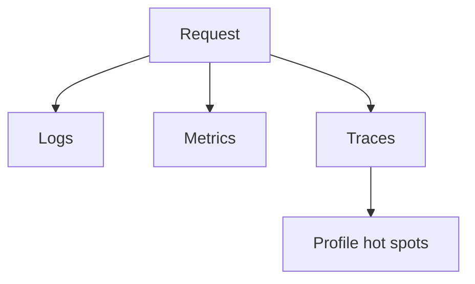

# Concurrency Debugging, Profiling, and Observability: Beginner-to-Expert Notes

## 1. Learning goals

By the end of this note, you should be able to:

- explain why concurrent bugs are hard to see;
- identify useful logs, traces, and metrics;
- understand how profiling helps concurrency work;
- know how to reason about stalled or overloaded tasks.

## 2. Prerequisites

- Basic concurrency concepts
- Error handling and logging awareness

## 3. Topic at a glance

Concurrent systems can fail in ways that are timing-sensitive and hard to reproduce.
Observability gives you enough information to understand what happened.

### Minimal first example

```python
print("trace")
```

Output:

```text
trace
```

Why this output?

The example is tiny on purpose: the point is that useful traces should be simple and clear.

Roadmap: first we build the mental model, then we learn observability signals, then we compare tools, and finally we practice debugging thinking.

## 4. Core vocabulary

| Term | Plain-language meaning | Example |
| --- | --- | --- |
| Log | recorded event | start/finish/error |
| Metric | numeric measurement | latency, queue depth |
| Trace | path of a request through a system | service spans |
| Profiling | measuring where time is spent | hotspots |

## 5. Mental model



## 6. Foundations

### 6.1 Logs explain what happened

### 6.2 Metrics show trends and saturation

### 6.3 Traces show request flow

## 7. How it works

Logs answer "what happened?", metrics answer "how much?", and traces answer "where did it go?".
Together they help you debug timing-sensitive failures and performance regressions.

## 8. Core operations or methods

- emit structured logs;
- record queue depth and latency;
- trace request paths;
- profile hotspots.

## 9. Guided examples

### Example 1: Simple log message

```python
print("start")
```

Output:

```text
start
```

### Example 2: Simple metric idea

```text
queue depth = 3
```

### Example 3: Simple trace idea

```text
request -> worker -> storage
```

## 10. Common patterns and real-world applications

- debugging stuck workers;
- investigating slow requests;
- tracking queue growth;
- measuring retry storms.

## 11. Common mistakes, misconceptions, and failure cases

### Mistake 1: Logging too little context

### Mistake 2: Logging too much noise

### Mistake 3: Ignoring queue depth or latency metrics

## 12. Comparison and decision guide

| Signal | Best use | Why |
| --- | --- | --- |
| Log | event detail | human-readable |
| Metric | trend monitoring | numeric and alertable |
| Trace | path analysis | request flow |

## 13. Efficiency, limitations, safety, and best practices

- keep logs structured and concise;
- measure latency and queue depth;
- add request or job identifiers;
- keep observability overhead reasonable.

## 14. Advanced concepts

- distributed tracing;
- correlation ids;
- sampling;
- alert thresholds.

## 15. Interview or assessment knowledge

- What do logs, metrics, and traces each tell you?
- Why are concurrent bugs hard to reproduce?
- Why is queue depth useful?

## 16. Practice exercises

1. Explain the purpose of logs.
2. Explain the purpose of metrics.
3. Explain the purpose of traces.
4. Explain why queue depth matters.
5. Explain why concurrency bugs are hard to reproduce.

### Solutions

#### Solution 1

Logs describe what happened.

#### Solution 2

Metrics show trends and magnitude.

#### Solution 3

Traces show the path through the system.

#### Solution 4

Queue depth matters because it shows backlog and pressure.

#### Solution 5

Concurrency bugs depend on timing, so they do not always repeat the same way.

## 17. Summary cheat sheet

| Signal | Remember |
| --- | --- |
| Logs | event detail |
| Metrics | numeric trend |
| Traces | request path |
| Profiling | hot spot analysis |

## 18. Mastery checklist and next steps

- [ ] I can explain logs, metrics, and traces.
- [ ] I know why concurrency bugs are tricky.
- [ ] I can name a few useful observability signals.

Next topics:

- `13_concurrency_design_patterns.md`
- `14_async_thread_process_integration.md`
