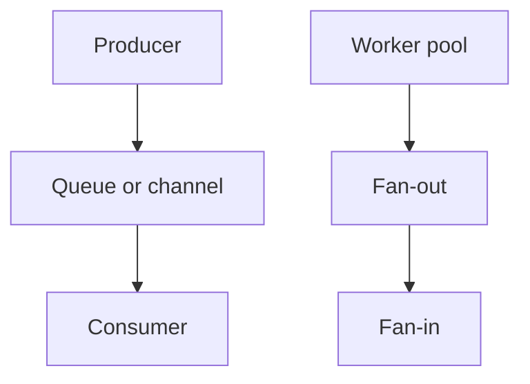

# Concurrency Design Patterns: Beginner-to-Expert Notes

## 1. Learning goals

By the end of this note, you should be able to:

- recognize common concurrency patterns;
- know when to use producer-consumer, fan-out/fan-in, and worker pools;
- keep ownership and communication clear;
- avoid overcomplicated concurrency design.

## 2. Prerequisites

- Sync, async, threads, and processes
- Reliability concepts like timeouts and backpressure

## 3. Topic at a glance

Concurrency design patterns are repeatable ways to structure concurrent work.
They help you keep systems understandable as they grow.

### Minimal first example

```python
print("producer -> consumer")
```

Output:

```text
producer -> consumer
```

Why this output?

The pattern name shows the basic direction of work.

Roadmap: first we build the mental model, then we learn the main patterns, then we compare them, and finally we practice choosing the simplest one.

## 4. Core vocabulary

| Term | Plain-language meaning | Example |
| --- | --- | --- |
| Producer-consumer | one side makes work, the other processes it | queue pipeline |
| Fan-out/fan-in | split work, then combine it | parallel steps |
| Worker pool | fixed set of workers | thread/process pool |
| Pipeline | staged work flow | step 1 -> step 2 |

## 5. Mental model



## 6. Foundations

### 6.1 Producer-consumer keeps roles clear

### 6.2 Fan-out/fan-in helps parallelize independent work

### 6.3 Worker pools cap concurrency

## 7. How it works

Patterns help answer two questions:

- who creates the work?
- who processes the work?

Clear answers make systems easier to reason about and debug.

## 8. Core operations or methods

- producer-consumer queues;
- worker pools;
- pipelines;
- fan-out/fan-in flows.

## 9. Guided examples

### Example 1: Producer-consumer

```text
make work, then consume work
```

### Example 2: Worker pool

```text
limit the number of active workers
```

### Example 3: Pipeline

```text
parse -> transform -> save
```

## 10. Common patterns and real-world applications

- file processing pipelines;
- task queues;
- request fan-out;
- staged data processing.

## 11. Common mistakes, misconceptions, and failure cases

### Mistake 1: Using a pattern because it sounds advanced

### Mistake 2: Not defining ownership of work

### Mistake 3: Building a pipeline when a simple loop is enough

## 12. Comparison and decision guide

| Pattern | Best use | Why |
| --- | --- | --- |
| Producer-consumer | queued work | clear ownership |
| Fan-out/fan-in | parallel subtasks | easy to split and combine |
| Worker pool | bounded concurrency | avoids overload |
| Pipeline | staged transformations | readable flow |

## 13. Efficiency, limitations, safety, and best practices

- choose the simplest pattern that fits;
- keep communication channels clear;
- bound concurrency deliberately;
- document ownership and shutdown behavior.

## 14. Advanced concepts

- staged pipelines;
- cancellation propagation;
- error aggregation;
- backpressure-aware queues.

## 15. Interview or assessment knowledge

- What is producer-consumer?
- Why use a worker pool?
- When is a pipeline a good choice?
- Why is bounded concurrency important?

## 16. Practice exercises

1. Explain producer-consumer.
2. Explain fan-out/fan-in.
3. Explain worker pools.
4. Explain when a pipeline is useful.
5. Explain why bounded concurrency matters.

### Solutions

#### Solution 1

Producer-consumer separates work creation from work processing.

#### Solution 2

Fan-out/fan-in splits work and then combines results.

#### Solution 3

Worker pools limit how many workers run at once.

#### Solution 4

A pipeline is useful when work happens in clear stages.

#### Solution 5

Bounded concurrency matters because it prevents overload.

## 17. Summary cheat sheet

| Pattern | Remember |
| --- | --- |
| Producer-consumer | queue-based flow |
| Fan-out/fan-in | split and combine |
| Worker pool | bounded workers |
| Pipeline | staged processing |

## 18. Mastery checklist and next steps

- [ ] I can name the common concurrency patterns.
- [ ] I know when to use each one.
- [ ] I understand why bounded concurrency matters.

Next topics:

- `14_async_thread_process_integration.md`
