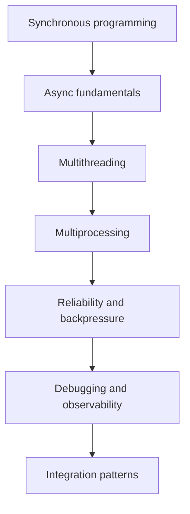
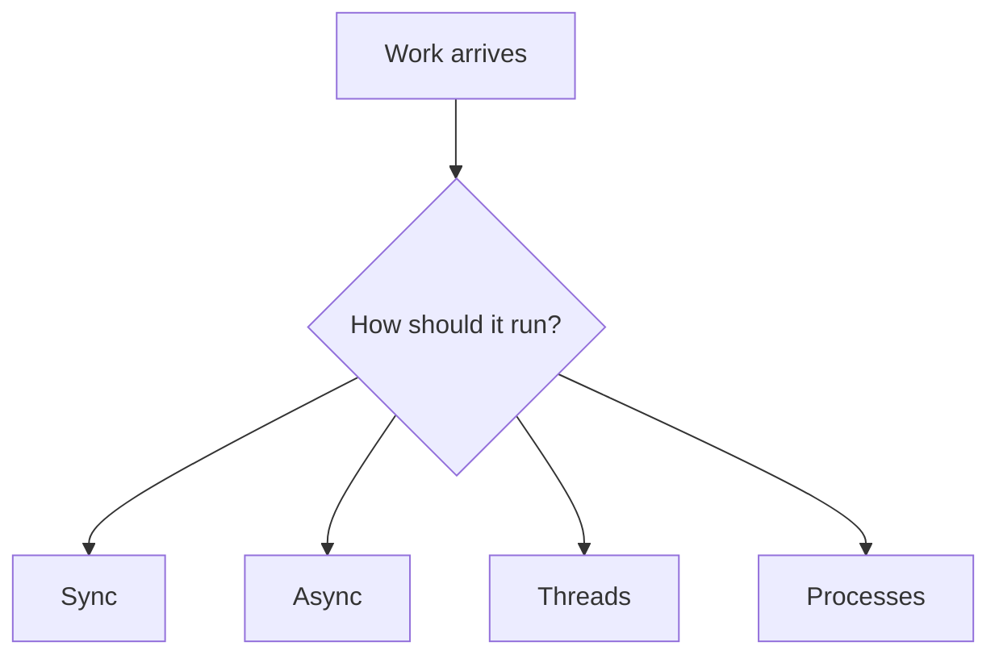

# Python Concurrency Mastery Roadmap: Beginner-to-Expert Notes

## 1. Learning goals

By the end of this track, you should be able to:

- choose between synchronous, async, threaded, and process-based concurrency;
- explain the tradeoffs between latency, throughput, and complexity;
- design reliable concurrent systems with proper timeouts and backpressure;
- debug and test concurrency-related behavior more confidently.

## 2. Prerequisites

- Python fundamentals
- Functions, modules, and exceptions

## 3. Topic at a glance

This folder teaches how to structure Python programs that do many things over time or at the same time.
It is the map for understanding sync, async, threads, processes, and reliability.

### Roadmap at a glance



## 4. Core vocabulary

| Term | Plain-language meaning | Example |
| --- | --- | --- |
| Sync | one step after another | normal function call |
| Async | waits without blocking everything | `async/await` |
| Thread | smaller execution path inside a process | `ThreadPoolExecutor` |
| Process | separate OS-level execution unit | multiprocessing |
| Backpressure | slowing input when downstream is busy | queue limits |
| Timeout | maximum wait time | `timeout=5` |

## 5. Mental model



## 6. Foundations

### 6.1 Understand sync before async

### 6.2 Use threads for I/O coordination

### 6.3 Use processes for CPU-bound parallel work

### 6.4 Keep timeouts and cancellation explicit

## 7. How it works

Concurrency is about organizing work over time.
Parallelism is about doing work at the same time.
The right tool depends on the bottleneck and the kind of task.

## 8. Core topics in this module

### 8.1 Synchronous programming

### 8.2 Async programming

### 8.3 Multithreading

### 8.4 Multiprocessing

### 8.5 Reliability and backpressure

### 8.6 Debugging and observability

### 8.7 Concurrency design patterns

### 8.8 Async/thread/process integration

## 9. Guided examples

### Example 1: Sync work

```text
do one thing, then the next
```

### Example 2: Async work

```text
wait without blocking the whole program
```

### Example 3: Parallel work

```text
split work across threads or processes when appropriate
```

## 10. Common patterns and real-world applications

- async I/O for network services;
- threads for waiting on many blocking tasks;
- processes for CPU-heavy workloads;
- queues and timeouts for reliability.

## 11. Common mistakes, misconceptions, and failure cases

- using threads for CPU work without checking the actual bottleneck;
- writing async code without understanding cancellation;
- ignoring timeouts and retries;
- mixing concurrency models without clear ownership.

## 12. Comparison and decision guide

| Need | Best choice | Why |
| --- | --- | --- |
| Simple logic | sync | easiest to read |
| Many I/O waits | async | efficient waiting |
| Blocking I/O fan-out | threads | coordinate waiting work |
| CPU-heavy parallel work | processes | bypasses GIL contention |

## 13. Efficiency, limitations, safety, and best practices

- choose the simplest concurrency model that fits the workload;
- use timeouts everywhere external work can block;
- keep cancellation and cleanup explicit;
- measure before scaling the design.

## 14. Advanced concepts

- structured concurrency;
- backpressure;
- observability;
- process/thread integration.

## 15. Interview or assessment knowledge

- When should you use async versus threads?
- Why are timeouts important?
- What is backpressure?
- Why is CPU-bound work different from I/O-bound work?

## 16. Practice exercises

1. Explain sync versus async.
2. Explain when threads help.
3. Explain when processes help.
4. Explain why timeouts matter.
5. Explain what backpressure means.

## 17. Summary cheat sheet

| Topic | Remember |
| --- | --- |
| Sync | simplest flow |
| Async | efficient waiting |
| Threads | I/O coordination |
| Processes | CPU parallelism |
| Reliability | timeouts and backpressure |

## 18. Mastery checklist and next steps

- [ ] I can explain the track goals.
- [ ] I know the major concurrency models.
- [ ] I understand the importance of timeouts.

Next topics:

- `10_multiprocessing_and_process_pools.md`
- `11_reliability_timeouts_retries_backpressure.md`
- `12_concurrency_debugging_profiling_observability.md`
- `13_concurrency_design_patterns.md`
- `14_async_thread_process_integration.md`
