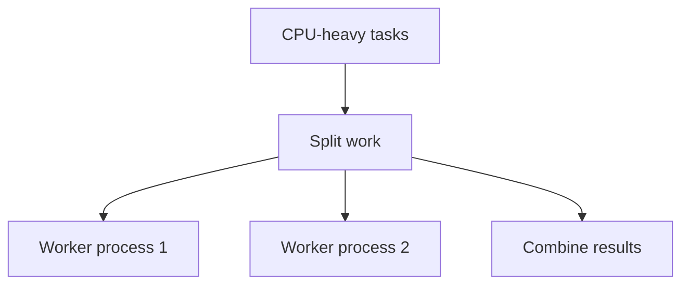

# Multiprocessing and Process Pools: Beginner-to-Expert Notes

## 1. Learning goals

By the end of this note, you should be able to:

- explain why processes are used for CPU-bound work;
- understand what a process pool does;
- know when multiprocessing is worth the overhead;
- recognize the need for a main guard on Windows.

## 2. Prerequisites

- Python fundamentals
- Basic idea of concurrency models

## 3. Topic at a glance

Multiprocessing runs work in separate operating-system processes.
It is useful when you want CPU-heavy tasks to run in parallel.

### Minimal first example

```python
def square(value: int) -> int:
    return value * value


print([square(value) for value in [1, 2, 3]])
```

Output:

```text
[1, 4, 9]
```

Why this output?

The example shows the work we might later distribute across processes.

Roadmap: first we build the mental model, then we learn process pools, then we compare them with threads and async, and finally we practice safe usage.

## 4. Core vocabulary

| Term | Plain-language meaning | Example |
| --- | --- | --- |
| Process | separate OS execution unit | worker process |
| Process pool | fixed set of worker processes | `ProcessPoolExecutor` |
| CPU-bound | limited by computation | hashing, parsing, math |
| Main guard | `if __name__ == "__main__"` | safe start point |

## 5. Mental model



## 6. Foundations

### 6.1 Use processes for CPU-heavy work

### 6.2 Keep process startup costs in mind

### 6.3 Protect the entry point with a main guard

## 7. How it works

Each process has its own Python interpreter and memory space.
That avoids some shared-state problems but adds startup and communication overhead.

## 8. Core operations or methods

- create a process pool;
- submit work to the pool;
- collect results;
- keep work units independent.

## 9. Guided examples

### Example 1: Pure computation

```python
def square(value: int) -> int:
    return value * value


print([square(value) for value in [1, 2, 3]])
```

Output:

```text
[1, 4, 9]
```

### Example 2: Pool usage concept

```text
map work across several processes and gather the results
```

### Example 3: Main guard

```python
if __name__ == "__main__":
    print("safe entry point")
```

Output:

```text
safe entry point
```

## 10. Common patterns and real-world applications

- heavy data transforms;
- CPU-bound batch jobs;
- parallel preprocessing;
- independent task fan-out.

## 11. Common mistakes, misconceptions, and failure cases

### Mistake 1: Using processes for tiny tasks

### Mistake 2: Forgetting the main guard on platforms that need it

### Mistake 3: Sending too much data between workers

## 12. Comparison and decision guide

| Need | Best choice | Why |
| --- | --- | --- |
| CPU-heavy parallel work | processes | independent interpreters |
| I/O coordination | threads or async | lower overhead |

## 13. Efficiency, limitations, safety, and best practices

- use processes when CPU work dominates;
- keep data transfer small;
- guard the entry point;
- measure overhead before scaling out.

## 14. Advanced concepts

- worker lifecycle;
- serialization costs;
- pool sizing;
- task distribution.

## 15. Interview or assessment knowledge

- Why use processes instead of threads for CPU work?
- Why is the main guard important?
- What is a process pool?

## 16. Practice exercises

1. Explain when processes help.
2. Explain the purpose of a process pool.
3. Explain the main guard.
4. Explain one cost of multiprocessing.
5. Explain why data transfer matters.

### Solutions

#### Solution 1

Processes help when CPU work is the bottleneck.

#### Solution 2

A process pool spreads work across a fixed set of workers.

#### Solution 3

The main guard prevents unwanted code execution on process startup.

#### Solution 4

Multiprocessing adds process startup and communication overhead.

#### Solution 5

Moving large data between processes can become expensive.

## 17. Summary cheat sheet

| Concept | Remember |
| --- | --- |
| Process | separate interpreter |
| Pool | worker group |
| Best use | CPU-heavy work |
| Main guard | safe startup |

## 18. Mastery checklist and next steps

- [ ] I can explain why processes are used.
- [ ] I know when a process pool makes sense.
- [ ] I understand the need for a main guard.

Next topics:

- `11_reliability_timeouts_retries_backpressure.md`
- `12_concurrency_debugging_profiling_observability.md`
- `14_async_thread_process_integration.md`
