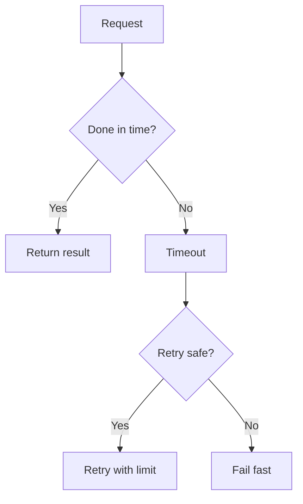

# Reliability, Timeouts, Retries, and Backpressure: Beginner-to-Expert Notes

## 1. Learning goals

By the end of this note, you should be able to:

- explain why timeouts are essential in concurrent systems;
- retry only operations that are safe to retry;
- understand backpressure and why it protects systems;
- design failure handling that fails fast instead of hanging.

## 2. Prerequisites

- Basic concurrency ideas
- Exceptions and error handling

## 3. Topic at a glance

Reliable concurrent systems do not just work when everything is perfect.
They also handle slow, failing, and overloaded conditions in a controlled way.

### Minimal first example

```python
def retry_once(success: bool) -> str:
    if success:
        return "ok"
    raise TimeoutError("request timed out")


print(retry_once(True))
```

Output:

```text
ok
```

Why this output?

The function returns success immediately when the operation completes in time.

Roadmap: first we build the mental model, then we learn timeouts and retries, then we learn backpressure, and finally we practice safe failure handling.

## 4. Core vocabulary

| Term | Plain-language meaning | Example |
| --- | --- | --- |
| Timeout | maximum wait time | `timeout=5` |
| Retry | try again after failure | repeat on timeout |
| Backpressure | slow the producer when the consumer is busy | bounded queue |
| Idempotent | safe to repeat | same result on retry |

## 5. Mental model



## 6. Foundations

### 6.1 Timeouts prevent indefinite waiting

### 6.2 Retries need limits and conditions

### 6.3 Backpressure keeps producers and consumers balanced

## 7. How it works

Timeouts turn waiting into a bounded decision.
Retries can hide temporary failures but must not turn into endless loops.
Backpressure protects the system by refusing to accept more work than it can safely handle.

## 8. Core operations or methods

- set a timeout;
- retry with a cap and backoff;
- bound queues or concurrency;
- stop or shed load when needed.

## 9. Guided examples

### Example 1: Successful result

```python
def reply(success: bool) -> str:
    return "ok" if success else "timeout"


print(reply(True))
```

Output:

```text
ok
```

### Example 2: Retry decision

```text
retry only when failure is temporary and safe to repeat
```

### Example 3: Backpressure idea

```text
limit the queue so overload becomes visible early
```

## 10. Common patterns and real-world applications

- network requests with timeouts;
- limited retries for transient errors;
- bounded queues for worker systems;
- controlled load shedding under pressure.

## 11. Common mistakes, misconceptions, and failure cases

### Mistake 1: Retrying non-idempotent actions blindly

### Mistake 2: Omitting timeouts

### Mistake 3: Letting queues grow without bounds

## 12. Comparison and decision guide

| Need | Best choice | Why |
| --- | --- | --- |
| Temporary failure | retry with limit | can recover |
| Slow dependency | timeout | prevents hangs |
| Overload control | backpressure | protects the system |

## 13. Efficiency, limitations, safety, and best practices

- set explicit deadlines;
- retry only safe operations;
- add backoff between retries;
- make queue limits visible and intentional.

## 14. Advanced concepts

- exponential backoff;
- jitter;
- circuit breakers;
- load shedding.

## 15. Interview or assessment knowledge

- Why are timeouts important?
- When is retry safe?
- What is backpressure?
- Why should queues be bounded?

## 16. Practice exercises

1. Explain why timeouts matter.
2. Explain why retries need limits.
3. Explain what backpressure does.
4. Explain when a retry is unsafe.
5. Explain why bounded queues help reliability.

### Solutions

#### Solution 1

Timeouts prevent indefinite waiting.

#### Solution 2

Retries need limits so failures do not loop forever.

#### Solution 3

Backpressure slows input when the system is busy.

#### Solution 4

A retry is unsafe when the operation is not idempotent.

#### Solution 5

Bounded queues stop overload from growing silently.

## 17. Summary cheat sheet

| Concept | Remember |
| --- | --- |
| Timeout | bounded wait |
| Retry | limited repetition |
| Backpressure | controlled input |
| Idempotent | safe to repeat |

## 18. Mastery checklist and next steps

- [ ] I understand why timeouts are essential.
- [ ] I can explain safe retries.
- [ ] I know what backpressure means.

Next topics:

- `12_concurrency_debugging_profiling_observability.md`
- `13_concurrency_design_patterns.md`
- `14_async_thread_process_integration.md`
