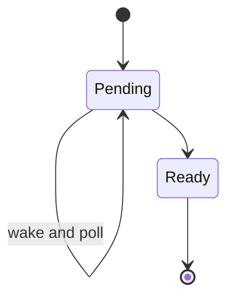

# 12 - Async, Futures, Tokio, Cancellation, and Backpressure

## What Async Solves

Async helps one thread manage many tasks that spend time waiting for I/O. It does not make CPU-heavy loops faster.

## Future Mental Model

A future is a state machine polled by an executor until ready.



## Async Function

```rust
async fn answer() -> i32 {
    42
}
```

Calling it creates a future; it does not run to completion without an executor and polling/await.

## Tokio Runtime

```toml
[dependencies]
tokio = { version = "1", features = ["macros", "rt-multi-thread", "time"] }
```

```rust
#[tokio::main]
async fn main() {
    let value = answer().await;
    println!("{value}");
}
// Output: 42
```

Use feature flags required by the project, not `full` automatically.

## Concurrent Await

```rust
let (left, right) = tokio::join!(load_left(), load_right());
```

`join!` drives futures concurrently on the same task. Spawn when independent task ownership/lifecycle is intended.

## Spawn

```rust
let handle = tokio::spawn(async move { 21 * 2 });
println!("{}", handle.await.expect("task panicked"));
// Output: 42
```

Spawned futures generally need `Send + 'static` on multi-threaded runtimes. Move owned data in.

## Cancellation by Drop

Dropping many futures cancels them cooperatively: they are no longer polled and local values drop. External side effects already sent may continue.

Cancellation safety matters when a future is dropped between steps. APIs document whether retrying/polling after cancellation can lose data.

## Timeout

```rust
use tokio::time::{timeout, Duration};

let result = timeout(Duration::from_secs(2), load_course()).await;
match result {
    Ok(course) => println!("{course:?}"),
    Err(_) => eprintln!("course load timed out"),
}
```

Timeout cancels waiting on the future; it is not rollback of server/database effects.

## Select

```rust
tokio::select! {
    result = load_course() => println!("{result:?}"),
    _ = shutdown.cancelled() => println!("shutdown"),
}
```

Review branch cancellation safety and fairness. Use a cancellation token from the appropriate maintained utility crate/runtime ecosystem.

## Channels

```rust
let (sender, mut receiver) = tokio::sync::mpsc::channel(100);
sender.send(42).await.expect("receiver closed");
println!("{}", receiver.recv().await.expect("sender closed"));
// Output: 42
```

Bounded channels provide async backpressure. Avoid unbounded channels for untrusted traffic.

## Mutex Choice

- `std::sync::Mutex`: short non-await critical section, often preferred
- `tokio::sync::Mutex`: guard must intentionally survive across await

Never hold a blocking mutex guard across await. Avoid holding any guard across slow external work.

## Blocking Work

```rust
let value = tokio::task::spawn_blocking(|| expensive_sync_work())
    .await
    .expect("blocking task panicked");
```

Use for bounded blocking/CPU operations. It uses a blocking pool; limit submitted work. For sustained CPU computation, a dedicated pool/service may be better.

## Async Traits

Modern Rust supports async functions in traits for many static-dispatch use cases. Dyn-compatible async traits may require boxing/adapter crates depending on API design. Understand allocation, Send bounds, and public compatibility.

## Pin and Futures

Some futures can contain self-references after polling and must not move. `Pin` expresses that contract. Ordinary async application code relies on runtime/macros to handle pinning; unsafe custom futures require expert proof.

## Structured Concurrency

Tasks should have parents/owners that await or cancel them. Detached tasks hide failures and outlive requests.

```text
request task
  -> child fetch A
  -> child fetch B
  -> await both or cancel both
```

## Backpressure

Bound:

- accepted connections
- in-flight requests
- task creation
- channel size
- database pool
- external requests
- retry count
- buffered response bytes

## Final Rules

- async for waiting, not CPU acceleration
- no detached task without process-level ownership
- bound every queue/pool
- timeouts and cancellation at boundaries
- validate cancellation safety
- use spawn_blocking sparingly/bounded
- never hold guards across external await
- propagate task errors and shutdown
