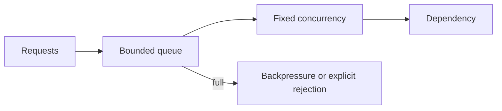

# 16 - Performance, Profiling, Observability, Security, and Deployment

Production Rust is more than a fast binary. It must remain correct under load, explain failures, protect data, and shut down cleanly.

## Optimize in the Correct Order

```text
correctness -> representative measurement -> bottleneck -> one change -> measurement -> regression test
```

Do not guess. A clever rewrite that does not affect the bottleneck adds risk without value.

## Debug and Release Profiles

```powershell
cargo run
cargo run --release
```

Debug builds favor compile speed and checks. Release builds enable optimization. Never use debug-build timings to predict production throughput.

A deliberate release profile can be declared in `Cargo.toml`:

```toml
[profile.release]
lto = "thin"
codegen-units = 1
strip = "symbols"
```

These choices can reduce runtime or binary size while increasing build time. Measure before adopting them. Keep debug information in a separate artifact if production profiling or crash analysis needs it.

## Measure Latency as a Distribution

An average hides slow requests. Track at least:

- throughput;
- p50, p95, and p99 latency;
- error and timeout rate;
- queue depth and saturation;
- CPU, memory, and allocation behavior;
- dependency latency and failure rate.

Use realistic input sizes, concurrency, network conditions, and warm-up behavior.

## Benchmark a Focused Operation

With a maintained benchmark harness such as Criterion:

```rust
use criterion::{black_box, criterion_group, criterion_main, Criterion};

fn normalize_tags(tags: &[&str]) -> Vec<String> {
    tags.iter().map(|tag| tag.to_ascii_lowercase()).collect()
}

fn bench_normalize_tags(criterion: &mut Criterion) {
    let tags = ["RUST", "ASYNC", "SYSTEMS"];
    criterion.bench_function("normalize three tags", |bencher| {
        bencher.iter(|| normalize_tags(black_box(&tags)))
    });
}

criterion_group!(benches, bench_normalize_tags);
criterion_main!(benches);
```

`black_box` reduces optimization that would make the benchmark unrealistic. A microbenchmark still cannot replace end-to-end load testing.

## Profile Before Editing

Useful evidence includes:

- sampling CPU profiles or flame graphs;
- allocation counts and heap profiles from suitable platform tools;
- operating-system I/O and scheduler traces;
- Tokio task and resource instrumentation for async systems;
- database query plans and connection-pool metrics.

Read a flame graph from the widest stack upward: width represents sampled CPU time, not call count.

## Common Performance Costs

### Unnecessary cloning

```rust
fn print_title(title: &str) {
    println!("title = {title}");
}

fn main() {
    let title = String::from("Rust Ownership");
    print_title(&title); // Borrow; no cloned allocation is needed.
    println!("still owned here: {title}");
}
```

Output:

```text
title = Rust Ownership
still owned here: Rust Ownership
```

Borrow when the callee only needs to observe. Clone when a separate owner is genuinely required.

### Repeated allocation

```rust
fn csv_line(values: &[&str]) -> String {
    let estimated = values.iter().map(|value| value.len()).sum::<usize>()
        + values.len().saturating_sub(1);
    let mut result = String::with_capacity(estimated);

    for (index, value) in values.iter().enumerate() {
        if index > 0 {
            result.push(',');
        }
        result.push_str(value);
    }

    result
}

fn main() {
    println!("{}", csv_line(&["go", "rust", "python"]));
}
```

Output:

```text
go,rust,python
```

Reserve capacity only when a useful estimate is cheap. Do not complicate code for tiny unmeasured gains.

### Accidental quadratic work

Repeatedly searching a `Vec` while processing many items can become O(n²). A `HashSet` gives expected O(1) membership; a `BTreeSet` gives ordered O(log n) membership. Choose based on required behavior, then measure.

## Bounded Concurrency

Unbounded task creation transfers overload into memory, latency, or a dependency.



Set limits for request bodies, queues, task counts, database connections, response sizes, retries, and timeouts. A limit should have an explicit failure response and metric.

## Structured Observability

Use a maintained structured tracing stack for spans and events. Prefer stable fields over prose embedded with values.

```rust
use tracing::{info, instrument};

#[instrument(skip(payload), fields(course_id = %course_id))]
fn index_course(course_id: &str, payload: &[u8]) {
    info!(payload_bytes = payload.len(), "course indexed");
}
```

The payload is skipped so raw content is not recorded. Record identifiers only when policy allows them.

Good telemetry answers:

- What operation failed?
- Which dependency or stage failed?
- How long did it take?
- Was the system saturated?
- Can related events be correlated safely?

Never record passwords, tokens, authorization headers, secret keys, or sensitive payloads.

## Metrics Cardinality

Safe labels have a bounded set of values, such as route template, status class, operation, or region. User IDs, raw URLs, error messages, and request IDs create unbounded label values and can overwhelm the metrics system.

Use traces or carefully protected logs for high-cardinality investigation.

## Error Context

Add context at architectural boundaries without logging the same error repeatedly:

```rust
use std::{fs, io, path::Path};

fn read_configuration(path: &Path) -> io::Result<String> {
    fs::read_to_string(path).map_err(|error| {
        io::Error::new(
            error.kind(),
            format!("failed to read configuration {}: {error}", path.display()),
        )
    })
}
```

Do not include secret configuration content in the error. The outermost application boundary can report the final error once.

## Security Boundaries

Treat command-line arguments, environment variables, files, network bodies, headers, database values, and FFI data as untrusted.

At each boundary:

1. limit the amount of data accepted;
2. parse into an exact type;
3. validate domain invariants without coercion;
4. reject unknown or unsupported variants where appropriate;
5. authorize the requested action;
6. pass only validated data inward.

## Files and Paths

- use an application-owned root directory;
- canonicalize existing paths when enforcing containment;
- reject paths outside the root;
- beware of symlink and check-then-use races;
- create files with restrictive permissions when they hold secrets;
- place temporary files on the correct filesystem before atomic replacement.

Do not build a shell command by joining untrusted strings. Call a program with separate arguments through `std::process::Command`, or use a library API.

## Network and Database Safety

- set connection, request, and operation timeouts;
- restrict redirect destinations when requests can be influenced externally;
- resolve and validate destinations for SSRF-sensitive clients;
- use TLS verification;
- use parameterized SQL queries;
- bound pools and transactions;
- avoid retrying non-idempotent work without an idempotency design.

## Dependency and Build Security

- commit `Cargo.lock` for applications and binaries;
- review new dependencies, features, build scripts, and procedural macros;
- use an advisory audit tool in CI;
- enforce license/source policy with an appropriate dependency-policy tool;
- pin the Rust toolchain when reproducible CI requires it;
- build from a controlled environment;
- generate provenance and a software bill of materials when policy requires them.

Run `cargo tree -e features` when a dependency unexpectedly expands. Default features can pull in code and capabilities the application does not need.

## Graceful Shutdown

A service should:

1. receive the shutdown signal;
2. stop accepting new work;
3. notify tasks through a cancellation mechanism;
4. wait for in-flight work up to a deadline;
5. flush required state and telemetry;
6. exit non-zero if shutdown failed.

Do not wait forever. A bounded shutdown deadline is part of the service contract.

## Deployment Checklist

- build and test the release artifact, not a different local binary;
- run as a non-privileged user;
- use a read-only filesystem where practical;
- inject secrets at runtime and rotate them;
- expose liveness separately from dependency readiness;
- set memory/CPU limits from load-test evidence;
- preserve symbols or maps required for diagnostics;
- document migrations, rollback, and compatibility;
- handle termination signals within the platform deadline.

## Final Rules

- correctness comes before speed;
- profile representative release builds;
- reduce allocation and cloning only where evidence matters;
- bound every scarce resource;
- make overload visible and intentional;
- use structured telemetry without secrets or unbounded labels;
- validate external data strictly;
- audit dependencies and build-time code;
- deploy the exact tested artifact;
- test startup, failure, and shutdown paths.

