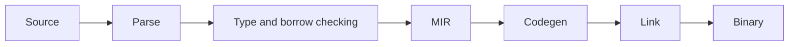

# 02 - Toolchain, Cargo, Crates, and Execution

## Verify Toolchain

```powershell
rustc --version
cargo --version
rustup show
```

Use stable Rust unless a reviewed project requirement needs nightly features.

## Create Project

```powershell
cargo new rust-course
Set-Location rust-course
cargo run
# Output: Hello, world!
```

Cargo creates `src/main.rs`:

```rust
fn main() {
    println!("Hello, world!");
}
```

Output:

```text
Hello, world!
```

`main` is the binary's entry point. `println!` is a macro that writes one formatted line to standard output. The exclamation mark tells you it is a macro invocation rather than a normal function call.

## Structure

```text
rust-course/
|-- Cargo.toml
|-- Cargo.lock
`-- src/
    `-- main.rs
```

- package: Cargo build/distribution unit
- crate: Rust compilation unit
- binary crate: executable with `main`
- library crate: reusable public API rooted at `lib.rs`
- module: namespace/privacy organization inside a crate

## Cargo Commands

```powershell
cargo check
cargo build
cargo run
cargo test
cargo fmt
cargo clippy --all-targets --all-features -- -D warnings
cargo doc --open --no-deps
```

`cargo check` type-checks quickly without producing the final executable.

## Development vs Release

```powershell
cargo build --release
```

Release enables optimized profile settings. Benchmark/profile the release build, not debug.

## `Cargo.toml`

```toml
[package]
name = "rust-course"
version = "0.1.0"
edition = "2024"

[dependencies]
```

Edition changes language migration defaults while preserving ecosystem interoperability. `cargo fix --edition` assists reviewed migrations.

## Lockfile

Commit `Cargo.lock` for applications/binaries. Library publication policy may differ, but workspaces/applications should keep reproducible resolution.

## Crate Compilation



Rust uses LLVM for common native code generation paths. Compiler internals can evolve; rely on stable language/tool contracts.

## Library and Binary Together

```text
src/
|-- lib.rs
`-- bin/
    `-- server.rs
```

Put testable application logic in the library; keep binary entry points focused on configuration and wiring.

## Features

Cargo features enable optional compile-time capabilities. Features are additive within one build graph.

```toml
[features]
default = []
json = ["dep:serde", "dep:serde_json"]
```

Test important feature combinations. Avoid mutually exclusive features when possible.

## Dependencies

```powershell
cargo add serde --features derive
cargo tree
cargo update -p package-name
```

Review licenses, maintenance, unsafe surface, transitive graph, features, MSRV, and vulnerability status.

## Workspaces

```toml
[workspace]
members = ["crates/domain", "crates/cli"]
resolver = "3"
```

Use workspaces for real package boundaries, not to split every folder.

## Profiles

```toml
[profile.release]
lto = "thin"
codegen-units = 1
```

These can improve runtime/size at build-time cost. Measure before customizing defaults.

## Unsafe and Build Scripts

Dependencies and `build.rs` execute code during build. Review supply-chain risk and sandbox CI according to policy.

## Production Rules

- stable toolchain pinned by policy when reproducibility matters
- Edition 2024 for new projects
- lockfile and dependency review
- format/check/clippy/test in CI
- release builds for profiling
- small binary entry points
- minimal feature/dependency graph
- no credentials in Cargo config or build output
