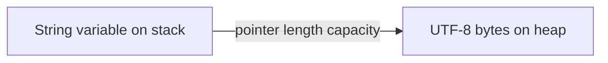

# 04 - Ownership, Moves, Copies, Borrowing, References, and Slices

## Why Ownership Exists

Rust must free heap memory exactly once without a garbage collector and prevent references from outliving data.

The compiler checks three core ideas:

1. every value has an owner
2. there can be only one owner at a time
3. the value is dropped when its owner leaves scope

## Stack and Heap Mental Model



The exact layout is an implementation detail, but the ownership model is stable.

## Move

```rust
let first = String::from("Rust");
let second = first;
println!("{second}");
// Output: Rust
// println!("{first}") would not compile: first was moved.
```

Rust transfers ownership instead of shallow-copying a heap owner and risking double free.

## Clone

```rust
let first = String::from("Rust");
let second = first.clone();
println!("{first} {second}");
// Output: Rust Rust
```

`clone` performs type-defined duplication and may allocate. Use it when ownership requirements justify the cost, not to silence every borrow error.

## Copy Types

Simple stack-only types commonly implement `Copy`:

```rust
let first = 10;
let second = first;
println!("{first} {second}");
// Output: 10 10
```

Types with `Drop` cannot be `Copy`.

## Function Ownership

```rust
fn print_and_return(text: String) -> String {
    println!("{text}");
    text
}

let course = String::from("Rust");
let course = print_and_return(course);
println!("{course}");
// Output:
// Rust
// Rust
```

Returning ownership works, but borrowing is simpler when a function only reads.

## Shared Borrow

```rust
fn length(text: &str) -> usize {
    text.len()
}

let course = String::from("Rust");
let size = length(&course);
println!("{course} {size}");
// Output: Rust 4
```

`&str` accepts borrowed string data without requiring ownership.

## Mutable Borrow

```rust
fn add_suffix(text: &mut String) {
    text.push_str(" course");
}

let mut title = String::from("Rust");
add_suffix(&mut title);
println!("{title}");
// Output: Rust course
```

## Borrowing Rule

At one time, a value can have:

- any number of shared references, or
- one exclusive mutable reference

But not both while they are used.

```rust
let mut text = String::from("Rust");
let first = &text;
let second = &text;
println!("{first} {second}");

let mutable = &mut text;
mutable.push('!');
println!("{mutable}");
// Output:
// Rust Rust
// Rust!
```

Non-lexical lifetimes let shared borrows end after their last use.

## Dangling References Are Rejected

```rust
// fn dangling() -> &String {
//     let value = String::from("temporary");
//     &value
// }
```

The local value would be dropped before the reference could be used.

Return ownership instead:

```rust
fn owned() -> String {
    String::from("safe")
}
```

## Slices

A slice borrows a contiguous region:

```rust
let text = String::from("Rust course");
let first = &text[..4];
println!("{first}");
// Output: Rust
```

`&str` is a borrowed UTF-8 string slice. `&[T]` is a borrowed sequence slice.

## UTF-8 Slice Boundary

String byte slicing panics if indexes are not UTF-8 character boundaries. Prefer iterator-based Unicode operations or validated boundaries.

```rust
let text = "語";
println!("{} {}", text.len(), text.chars().count());
// Output: 3 1
```

## Slice Parameters

Prefer borrowed slices for read-only inputs:

```rust
fn total(values: &[i32]) -> i32 {
    values.iter().sum()
}
println!("{}", total(&[1, 2, 3]));
// Output: 6
```

Use `&str` instead of `&String`; `&[T]` instead of `&Vec<T>` when only slice behavior is needed.

## Reborrowing

Mutable references can be temporarily reborrowed so an owner can keep using them after the shorter borrow ends. The compiler tracks these lifetimes automatically in common calls.

## Partial Moves

Moving one non-Copy field can leave other fields usable but the whole struct unavailable:

```rust
struct Course {
    id: String,
    lessons: u32,
}

let course = Course { id: String::from("rust"), lessons: 12 };
let id = course.id;
println!("{id} {}", course.lessons);
// Output: rust 12
```

## Borrow Checker Reading Strategy

When code fails:

1. identify who owns each value
2. mark where moves occur
3. mark shared/mutable borrows and last uses
4. ask whether the function needs ownership, shared borrow, or mutable borrow
5. narrow borrow scope
6. redesign ownership before adding clones

## API Ownership Guide

| Need | Parameter/return |
|---|---|
| read text | `&str` |
| read sequence | `&[T]` |
| mutate caller value | `&mut T` |
| store beyond call | owned `T` |
| optional borrow | `Option<&T>` |
| create result | return owned `T` |

## Expert Rules

- borrowing is an API contract
- clones are ownership decisions
- short borrows improve composition
- return owned values when constructing
- do not expose references tied to temporary guards
- model shared mutation explicitly with safe synchronization
- understand UTF-8 byte boundaries
