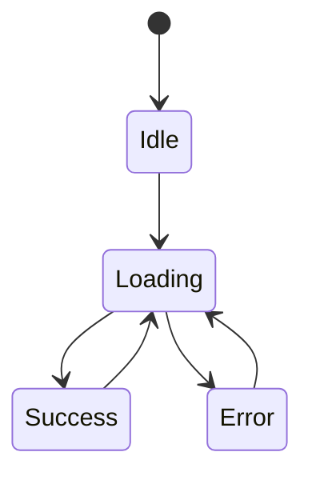

# 05 - Structs, Enums, Pattern Matching, Option, and Result

## Structs

```rust
#[derive(Debug, Clone, PartialEq, Eq)]
struct Course {
    id: String,
    title: String,
}

let course = Course {
    id: String::from("rust"),
    title: String::from("Rust"),
};
println!("{course:?}");
// Output: Course { id: "rust", title: "Rust" }
```

Derive only traits whose semantics are correct for the domain.

## Methods

```rust
impl Course {
    fn new(id: impl Into<String>, title: impl Into<String>) -> Result<Self, String> {
        let id = id.into();
        let title = title.into();
        if id.trim().is_empty() || title.trim().is_empty() {
            return Err(String::from("id and title are required"));
        }
        Ok(Self { id, title })
    }

    fn label(&self) -> String {
        format!("{}: {}", self.id, self.title)
    }
}
```

- `&self`: read
- `&mut self`: mutate
- `self`: consume
- associated function: no self, such as `new`

## Tuple and Unit Structs

```rust
struct CourseId(String);
struct Marker;
```

Tuple newtypes add domain distinction without named fields.

## Enums Carry Data

```rust
enum Message {
    Text(String),
    Progress { completed: u32, total: u32 },
    Finished,
}

let message = Message::Progress { completed: 3, total: 10 };
```

One enum value is exactly one variant, preventing invalid combinations.

## Match Destructuring

```rust
let label = match message {
    Message::Text(text) => text,
    Message::Progress { completed, total } => format!("{completed}/{total}"),
    Message::Finished => String::from("done"),
};
println!("{label}");
// Output: 3/10
```

## `if let` and `let else`

```rust
let value = Some(42);
if let Some(number) = value {
    println!("{number}");
}
// Output: 42
```

```rust
fn require_title(value: Option<&str>) -> Result<&str, String> {
    let Some(title) = value else {
        return Err(String::from("title is required"));
    };
    Ok(title)
}
```

Use match when several cases matter; `if let` for one important pattern.

## Match Guards

```rust
match score {
    value if value >= 70 => println!("passed"),
    _ => println!("retry"),
}
```

Guards add conditions but reduce exhaustiveness analysis within guarded patterns. Keep them clear.

## Option

```rust
let title = Some("Rust");
let length = title.map(str::len).unwrap_or(0);
println!("{length}");
// Output: 4
```

Useful methods: `map`, `and_then`, `filter`, `unwrap_or`, `ok_or`.

Avoid `unwrap` for runtime absence unless an invariant is proven and documented.

## Result

```rust
fn parse_level(text: &str) -> Result<u8, String> {
    let value: u8 = text.parse().map_err(|_| String::from("level must be a number"))?;
    if !(1..=5).contains(&value) {
        return Err(String::from("level must be 1 through 5"));
    }
    Ok(value)
}

println!("{}", parse_level("3")?);
// Output: 3 (inside a function returning compatible Result)
```

`?` returns early on error and converts through `From` when required.

## Combinators vs Match

Combinators are concise for straight transformations. Use match/early returns when branches need different business behavior, logging, or recovery.

## Niche Optimization

Rust can represent some enums without extra size, such as `Option<&T>`, because null pointer representation is otherwise invalid. Treat layout as guaranteed only where Rust documents it, especially across FFI.

## Exhaustive State Modeling



Represent with an enum so loading cannot simultaneously hold an error and success result unless explicitly modeled.

## Expert Rules

- structs group always-present fields
- enums model alternatives
- match exhaustively
- Option models absence
- Result models expected failure
- `?` propagates with context/type conversion
- constructors protect invariants
- avoid boolean fields that create impossible state combinations
