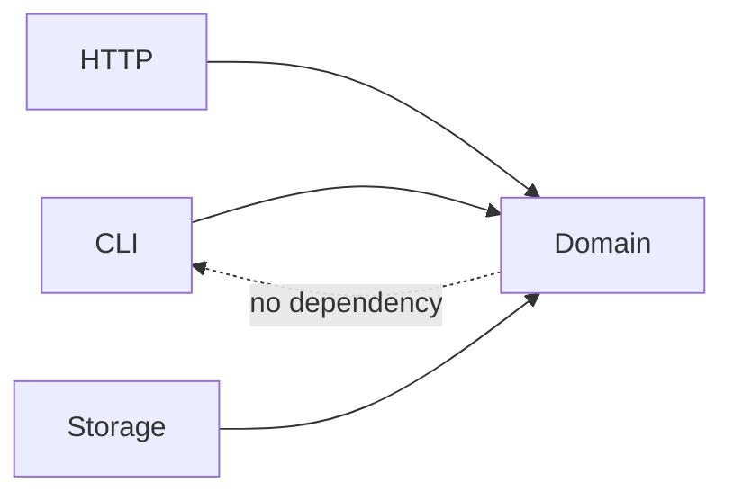

# 08 - Modules, Crates, Workspaces, Visibility, and API Design

## Module Tree

```text
src/
|-- lib.rs
|-- course.rs
`-- course/
    `-- repository.rs
```

```rust
// lib.rs
pub mod course;
```

Modern Rust module paths map declarations to files without requiring `mod.rs`.

## Visibility

- private by default
- `pub`: visible through public module path
- `pub(crate)`: within crate
- `pub(super)`: parent module
- `pub(in path)`: selected ancestor scope

Expose the smallest required API.

## Use and Re-export

```rust
pub use course::{Course, CourseId};
```

Re-exports shape a stable public API independent of internal file layout.

## Crates

- library crate: `src/lib.rs`
- default binary: `src/main.rs`
- extra binaries: `src/bin/*.rs`
- integration tests: `tests/*.rs`
- examples: `examples/*.rs`
- benchmarks: `benches/*.rs`

## Workspace Structure

```text
workspace/
|-- Cargo.toml
`-- crates/
    |-- domain/
    |-- storage/
    `-- cli/
```

Use separate crates for real compilation/dependency/publication boundaries, not every conceptual layer.

## Public API Design

```rust
pub struct Course {
    id: CourseId,
    title: String,
}

impl Course {
    pub fn new(id: CourseId, title: String) -> Result<Self, ValidationError> {
        // validate invariant
        Ok(Self { id, title })
    }

    pub fn title(&self) -> &str {
        &self.title
    }
}
```

Private fields preserve invariants. Getters return borrowed views where ownership need not transfer.

## `#[non_exhaustive]`

Public enums/structs can use `#[non_exhaustive]` to reserve compatible additions. Consumers must include a wildcard and cannot construct external non-exhaustive structs directly.

Use it deliberately; it changes ergonomics.

## Sealed Traits

A private supertrait can prevent external implementations while allowing public use. This preserves evolution but reduces extensibility. Document the choice.

## Feature Flags

Features should be additive:

```toml
[features]
default = []
serde = ["dep:serde"]
```

Test no-default, default, and all-feature builds as applicable.

## Dependency Direction



The domain can define traits required from adapters, or application wiring can use concrete types. Avoid cycles through a “common” crate that accumulates everything.

## SemVer

Public type/layout/trait changes may break downstream code. Breaking changes include:

- removing/renaming public item
- adding required trait methods without defaults
- changing error variants consumers match exhaustively
- tightening bounds
- changing feature behavior
- changing MSRV unexpectedly

Use tooling and downstream compile tests for public libraries.

## Documentation

```rust
/// Creates a validated course.
///
/// # Errors
/// Returns [`ValidationError::EmptyTitle`] when `title` is empty.
pub fn new(title: String) -> Result<Self, ValidationError> {
    if title.is_empty() {
        return Err(ValidationError::EmptyTitle);
    }

    Ok(Self { title })
}
```

This excerpt assumes the surrounding `Course` and `ValidationError` definitions from the API being documented. Published documentation examples should compile as tests. Do not use ellipses in Rust code blocks; show the relevant implementation or use a `text` block for pseudocode.

## Build Scripts and Proc Macros

Build scripts/procedural macros execute code during builds. Minimize and audit them as supply-chain boundaries.

## Expert Rules

- private by default
- public API independent of file layout
- re-export deliberate entry points
- crates for real boundaries
- additive features
- documented MSRV/edition policy
- semver review for public changes
- audit code executed during build
